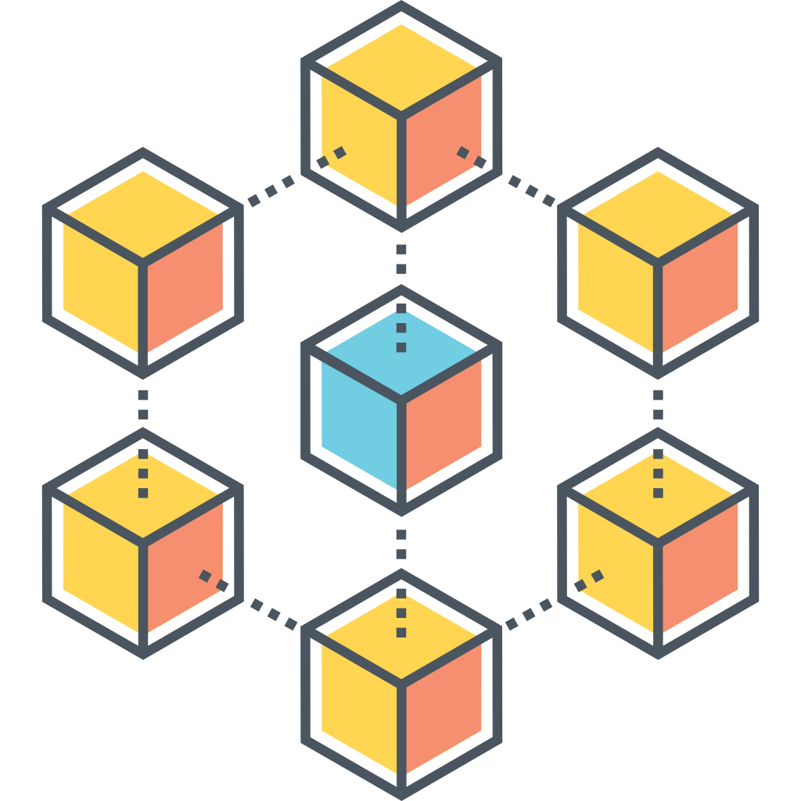

<!-- PROJECT LOGO -->
<br />
<div align="center">
  <a href="https://github.com/levblanc/web3-blockchain-solidity-course-js">
    
  </a>

  <h2 align="center">Web3, Full Stack Solidity, Smart Contract & Blockchain development with JavaScript</h2>

  <p align="center">
    My Web3 full stack Solicity smart contract & blockchain development journey along with 
    <br />
    <a href="https://youtu.be/gyMwXuJrbJQ"> » this course from Patrick Collins</a>
  </p>
</div>

<br />

<div align="center">
  <p align="center">
    <a href="https://github.com/levblanc/web3-nft-marketplace-graph"></a>
  </p>

<a href="https://github.com/levblanc/web3-nft-marketplace-graph">View Code</a> ·
<a href="https://github.com/levblanc/web3-nft-marketplace-nextjs-thegraph">View
Front End Code</a> ·
<a href="https://github.com/levblanc/web3-blockchain-solidity-course-js">Check
My Full Journey</a>

</div>

<br />

<p align="center">
  <a href='https://web3-nft-marketplace-lime.vercel.app'></a>
</p>

<br />

<!-- GETTING STARTED -->

## Getting Started

1. Clone the repo

```sh
git clone https://github.com/levblanc/web3-nft-marketplace-graph.git
```

2. Install dependencies with `yarn install` or `npm install`

3. Generate classes for graphql schema & marketplace contract

```zsh
graph codegen
```

4. Build for deploying subgraph

```zsh
graph build
```

Other available commands in `package.json`.

## Skills

- [![TheGraph]](https://thegraph.com/en/)
- [![GraphQL]](https://graphql.org/)

## Roadmap

- [x] Setup subgraph env
- [x] Build a subgraph to handle the events emit from NFT marketplace contract
- [x] Deploy to Subgraph Studio on The Graph

#

### [» Check the main repo of my full web3 journey](https://github.com/levblanc/web3-blockchain-solidity-course-js)

<!-- MARKDOWN LINKS & IMAGES -->
<!-- https://www.markdownguide.org/basic-syntax/#reference-style-links -->

[thegraph]:
  https://custom-icon-badges.demolab.com/badge/TheGraph-0C0A1C?style=for-the-badge&logo=thegraph&logoColor=white
[graphql]:
  https://img.shields.io/badge/GraphQL-E10098.svg?style=for-the-badge&logo=GraphQL&logoColor=white
